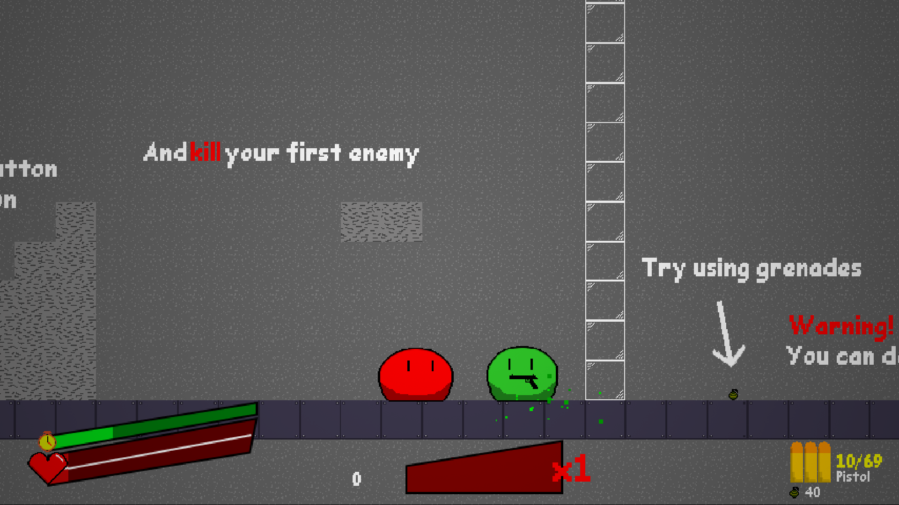
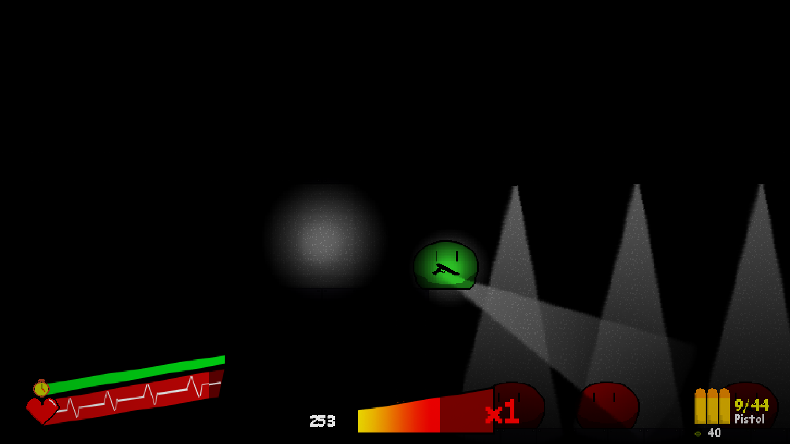
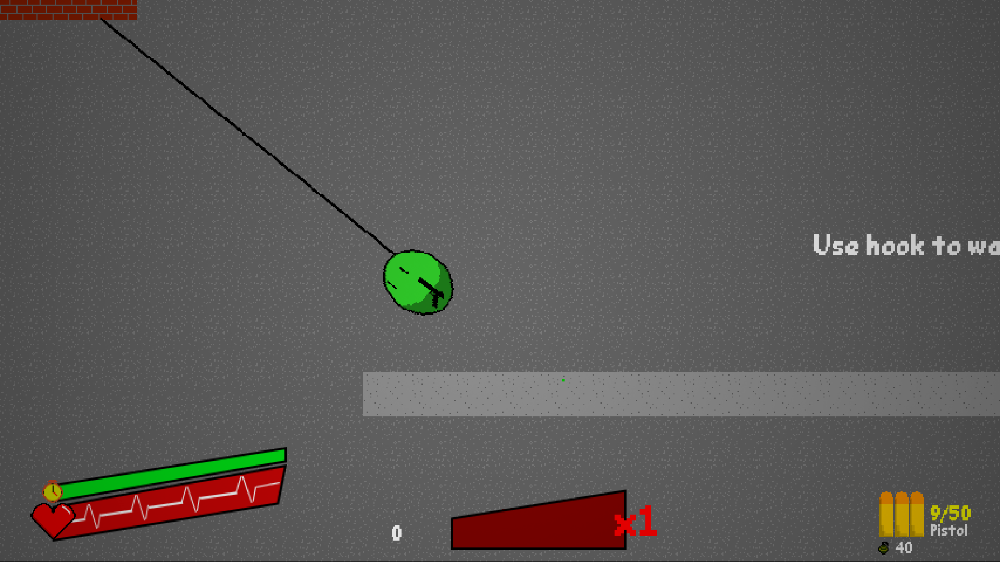
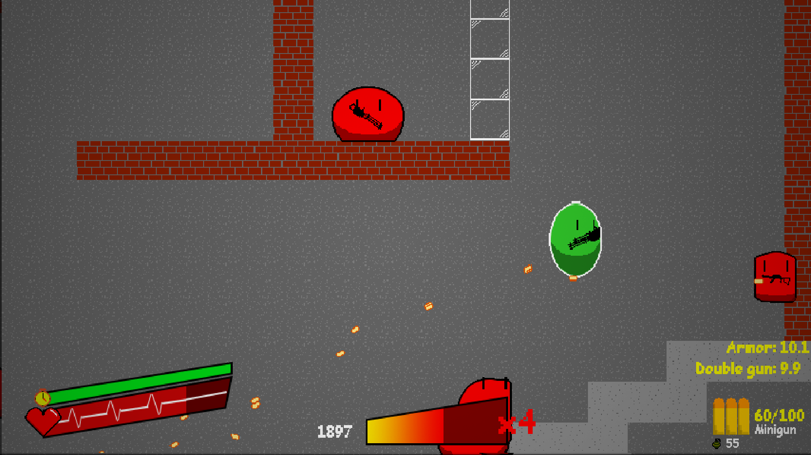
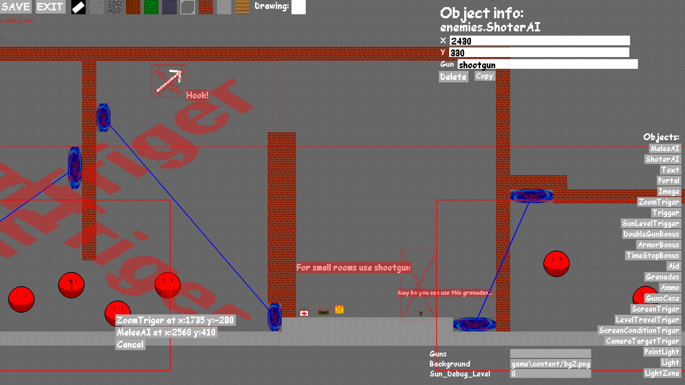

# Slime Sandbox (вводный проект ВКИ НГУ 15.03.22), сделал Максим Фадеенко ([MaxGyverTech](https://github.com/MaxGyverTech))
------------------
## Эта игра - шутер-песочница. Её концепция заключется в том что игроки будут строить уровни друг для друга и проходить их
## Ключевые особенности:

* 2d физика
* Использование только Python + Pygame (если в настройках стоит запрет на `C`, иначе подключается `Game.dll`), а так же только своих ассетов(картинок и тд.)
* Проработаное поведение оружия
* Большая работа над оптимизацией
* Простой ИИ
* Простое освещение (в `C` версии используется трассировка луча)
* Система виджетов для лёгкого создания интерфейса
* Функции и тригеры для камеры
* Множество объестов для уровней
* Редактор карт
* Лёгкая модификация: можно легко добавить новые предметы или изменить существующие, а так же скрипты на уровнях
* Прототип мультиплеера

## Планы на будущее:

* Доделать мультиплеер
* Расширить редактор карт
* Улучшить ИИ врагов
* Улучшить оптимизацию
* Бесконечный режим

## Для запуска необходимо:
* Установить [Python](https://www.python.org/downloads/) (При установке выберите "Add to PATH")
* В консоли ввести `pip install pygame`
* В папке с игрой есть файл `start_game.bat`, запустите его

## Скриншоты из игры

## По поводу ошибок/предложений писать [сюда](https://t.me/maxgyvertech)